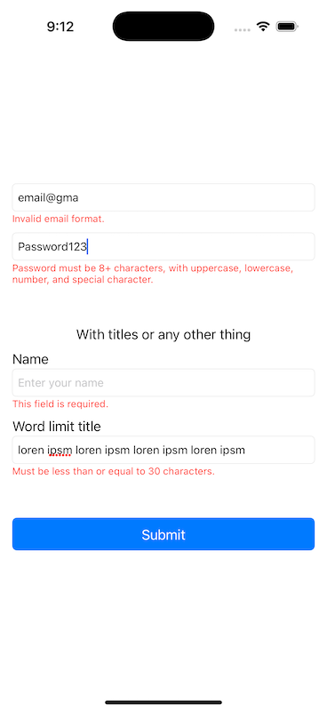
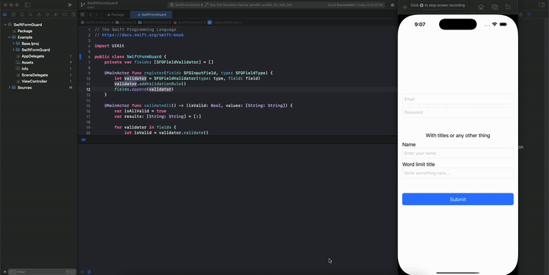

# SwiftFormGuard

**SwiftFormGuard** is a lightweight Swift library for creating **inline warning fields** with **live input validation** using `UITextField`. Just register your field with a type, and it automatically checks input against validation rules and displays contextual inline errors in real time.

- ✅ Clean, user-friendly inline error messages  
- ⚡️ Real-time validation using `UITextFieldDelegate`  
- *🧩 Supports built-in and Custom rules. (coming-soon)*
- *🌐 Custom error messages. (coming-soon)*

---

## 📸 Screenshots



---

## 🎞 Demo



---

## ✨ Features

- Modular validation rules (required, email, numeric, password, etc.)
- Developer-defined field types for reusable validation
- Full control over validation logic and error strings (coming-soon)
- Clear API for showing/hiding inline errors
- Override built-in rules without modifying the core lib (coming-soon)

---

## 🛠 Installation

SwitfFormGuard was originally built for personal use, so customization of validation rules or error messages currently requires modifying the core source files. This is a known limitation and improvements are in progress to support external rule injection and message overrides.

In the meantime, feel free to copy the `SwiftFormGuard` folder directly into your project and make any modifications needed to suit your use case.

## 🧪 Usage

### 1. Add the UI Components in Storyboard  
- Drag a `UIStackView` onto your view.
- Place a `UITextField` inside the stack view.
- Assign the class `SFGInputField` (provided by the library) to the `UIStackView`.

### 2. Connect the TextField Outlet  
- In Interface Builder, select the `SFGInputField`.
- Connect its `textField` outlet to the `UITextField` inside the stack view.

### 3. Create the Validator Instance  
In your view controller, declare an instance of `SwiftFormGuard`:

```swift
private let validator = SwiftFormGuard()
```
### 4. Register Your Input Fields

Register each input field with the validator, specifying the expected field type:

```swift
validator.register(field: emailField, type: .email)
validator.register(field: passwordField, type: .password)
validator.register(field: nameField, type: .name)
validator.register(field: wordLimitField, type: .language)
```

### 5. Validate on submit

Trigger validation when the user taps the submit button:

```swift
@IBAction func didTapSubmit(_ sender: UIButton) {
    let result = validator.validateAll()
    if result.isValid {
        let values = result.values
        print("Validation succeeded with values: \(values)")
    } else {
        print("Validation failed!")
    }
}
```

## What next?

- Code updation and restructering for SwiftPackage and Cocoapods integration
- Custom Rules, Errors and FieldTypes
- TextView integration

## 📄 License
MIT License. See LICENSE for details.
